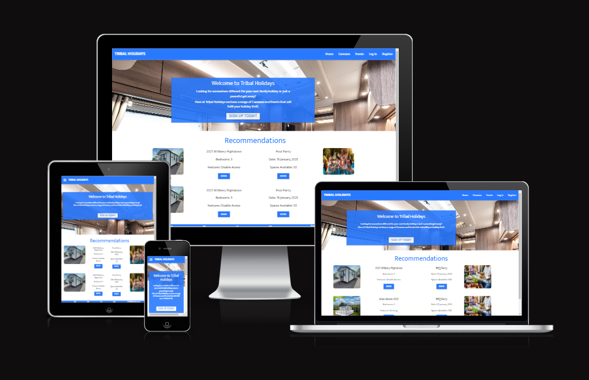
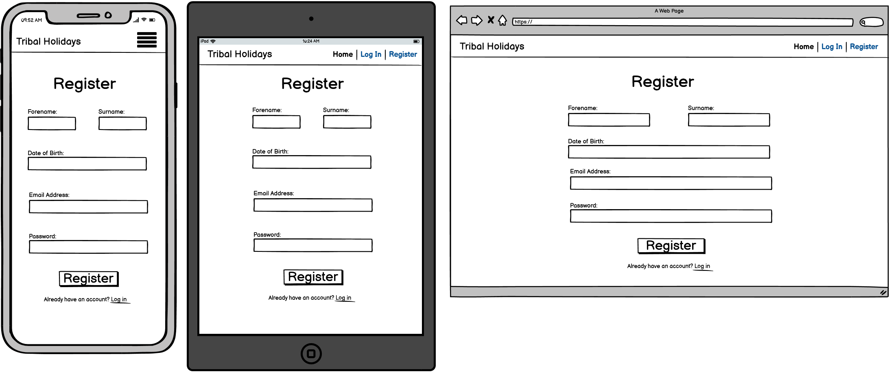
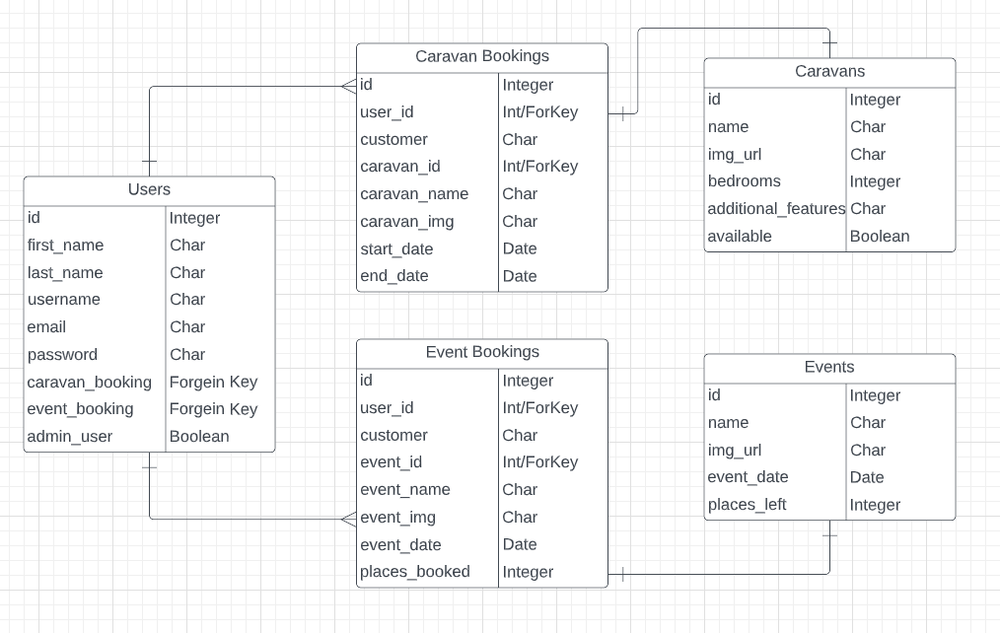

# Tribal Holidays

Click here to vist the [Tribal Holidays](https://tribal-holidays-abaron.herokuapp.com/) website

## Project Purpose
This project will extend beyond the basic structure and functionality of a website by including connections to a databases and working with python logic, to implement CRUD functionality that will allow users on the website being both customers and admin to interact in a more logical way to achieve a improved user expierience throughout the website.

----
## User Stories
As a new user to the website I would like to register so I can begin my holiday search.

As a current user I would like to login so I can search and book my next holiday.

As a customer I would like to be able to see all the caravans and filter the search so I can find the exact caravan I'm looking for.

As a customer I would like to be able to see all the events that are available so I can include activites into my holiday.

As a user I would like to view my profile so I can see my bookings and also change my password.

As an admin of the site I would like to view all the data for caravans and events so I can add more, update details or delete out dated records.

----
## Features
* All users:
    * Register/Login
    * View profile & change account password.

* Customers: 
    * Search caravans & filter search by specific/additional features
    * Search events & filter by specific dates

* Admin users:
    * Create new records for caravans & events
    * Update data for caravans or events
    * Delete records

----
## Future Features
* Users to be able to add their own cararvans & events, being either a different caravan holiday park or just user looking to rent out their own caravan that resides on a caravan park.

----
## Typography & Colour Scheme
* Font: [Mukta](https://fonts.google.com/specimen/Mukta)

* Colour Scheme:
    * Background: Lightly darkened blue.
    * Font: Offset white.
    * Colours will switch if background colour is white.

----
## Wireframes
Landing Page(New User)

Landing Page(Logged In)

Login Page

Register Page

Profile Page

Caravans Page

Events Page

## Database
With databases there are 2 different types of databases which are relational and non-relational, the main thing that seperates these types are that one incorporates relationship between the tables with the database schema and the other doesn't. For this production PostgreSQL will be the database used which is a relational database and to demonstrate how the relationships look find the ERD diagram below.

ERD (Entity Relationship Diagram)

Within the ERD you can see the different relationships but only two types are used which are 'One-to-One' & 'One-to-Many' and all they mean is that one record will to one and only one other record that exists in the table to relationship is linked to, 'One-to-Many' means that one record in a table can be related to multiple records in another but not vise-versa.
For Example in the ERD above there's a One-to-Many relationship between the Users entity and the Caravan Bookings entity so a user can many bookings but only a caravan booking can be connected to one user.

## Technology Used
Balsamiq Wireframes - Used to build/create the visual outline for the different web pages that the website consists of.

GitPod - Cloud based IDE used to create and build the code for the website.

HTML - Programming language used to build the structure of the website/web pages by the use of elements and different components.

CSS - The styling for the website, used to make the web pages more visually appealing.

Materialize - An external libary used that aims to focus on the resposiveness of the website, as well as the basic structure and styling for the website.

Python - Programming language used to construct the functionality for the website that allows data to be intergrated from the database to the user and reversed based on a users interactions.

PostgresSQL - Relational database used to store data that has been added by a user in to different tables and relays data back through various queries.

JavaScript - Provides additional functionality but is mainly used to initialize Materialize components such as the modals, datepicker etc.

GitHub - A cloud based storage used as the version control for the production by committing and pushing at various stages throughout the development.

ElephantSQL - Used to host the SQL server in the final deployment.

Heroku - Used to deploy the final development.

----
# Testing
[Click here](docx/testing.md) to redirect to the Testing file

## Screens
Each web pages has been tested to make sure that they are fully responsive across all screen sizes beginning with mobile devices and increasing upwards to tablets, laptops and finally desktops as it's the largest screen size expected for a browser window.

----
## Deployment
Two versions on deployment:
* GitPod - used throughout the development by typing 'python3 -m http.server' in the terminal which gives a prompt to open in a new tab within the browser.
* Heroku - the final deployment of the website which makes it accesible to the public.

----
## Credits

### External Code
* Materialize:
    * Collapsable Nav Bar
    * Modals
    * Datepickers
