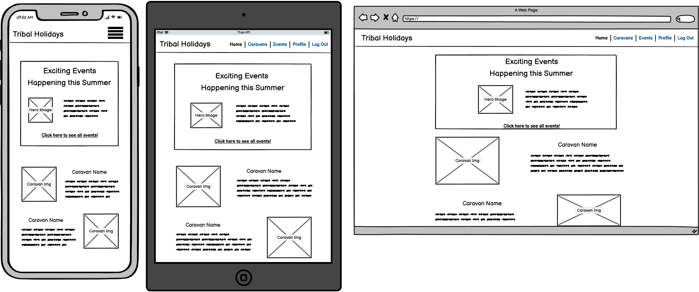
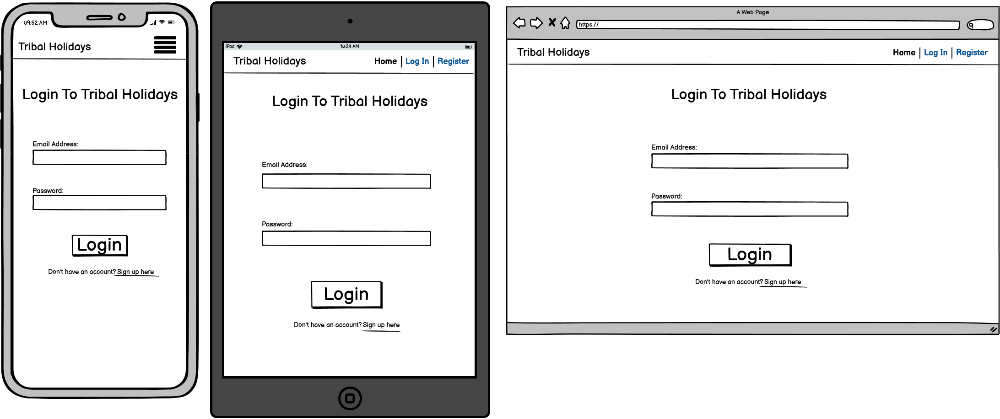

# Tribal Holidays
responive-image

Click here to vist the Tribal Holidays website (Link)

## Project Purpose
This project will extend beyond the basic structure and functionality of a website by including connections to a databases and working with python logic, to implement CRUD functionality that will allow users on the website being both customers and admin to interact in a more logical way to achieve a improved user expierience throughout the website.

----
## User Stories
As a new user to the website I would like to register so I can begin my holiday search.

As a current user I would like to login so I can search and book my next holiday.

As a customer I would like to be able to see all the caravans and filter the search so I can find the exact caravan I'm looking for.

As a customer I would like to be able to see all the events that are available so I can include activites into my holiday.

As a user I would like to view my profile so I can see my bookings and also change my password.

As an admin of the site I would like to view all the data for caravans and events so I can add more, update details or delete out dated records.

----
## Features
* All users:
    * Register/Login
    * View profile & change account password.

* Customers: 
    * Search caravans & filter search by specific/additional features
    * Search events & filter by specific dates

* Admin users:
    * Create new records for caravans & events
    * Update data for caravans or events
    * Delete records

----
## Future Features

----
## Typography & Colour Scheme
* Font: [Mukta](https://fonts.google.com/specimen/Mukta)

* Colour Scheme:
    * Background: Lightly darkened blue.
    * Font: Offset white.
    * Colours will switch if background colour is white.

----
## Wireframes
Landing Page(New User)

Landing Page(Logged In)

Login Page

Register Page

Profile Page

Caravans Page

Events Page
