# Testing
## User Stories
US = User story (e.g US One = user story one)
### US One
1. Open the side navbar and locate the register button.
2. (Larger Screens) Locate the register button on the right side of the navbar.
3. Fill out the form with your name, a username, your email and a password then submit.

### US Two
1. Open the side navbar and locate the log in button.
2. (Larger Screens) Locate the log in button on the right side of the navbar.
3. Enter your accounts username and your password for the account.
4. If the details are correct you'll be logged in redirected to the home page, if not you'll be alerted that the username or password is wrong.

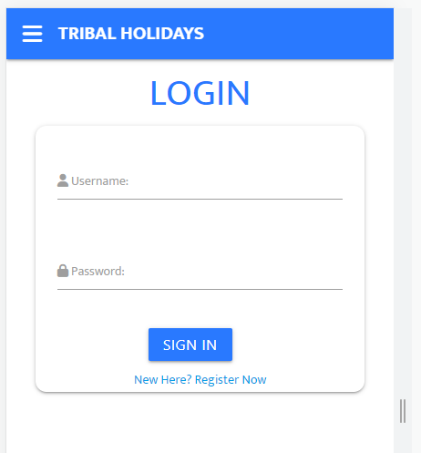

### US Three
1. Open the side navbar and locate the caravans button.
2. (Larger Screens) Locate the caravans button on the right side of the navbar.
3. Scroll through all the caravans or search for caravans with a specific number of bedrooms or caravans with certain features.

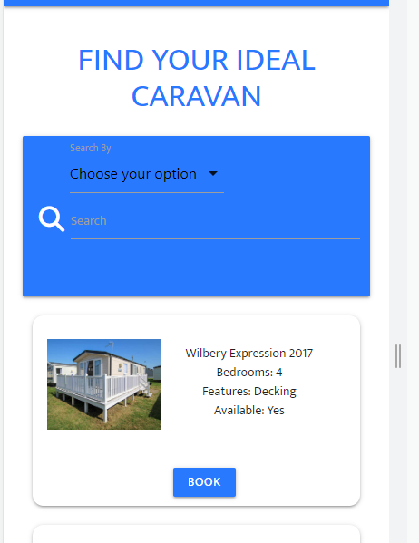

### US Four
1. Open the side navbar and locate the events button.
2. (Larger Screens) Locate the events button on the right side of the navbar.
3. Scroll through all the events or search for events with a certains number of spaces available or events happening on a specific date.

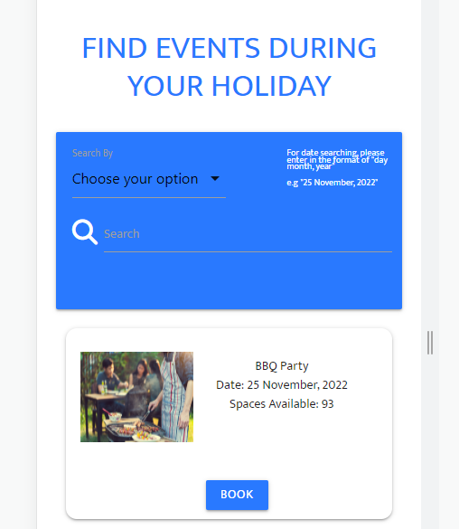

### US Five
1. Open the side navbar and locate the profile button.
2. (Larger Screens) Locate the profile button on the right side of the navbar.
3. Scroll down the page to see your profile details, caravan bookings and event bookings.

### US Six
1. Open the side navbar and locate the dashboard button.
2. (Larger Screens) Locate the dashboard button on the right side of the navbar.
3. Scroll down the page to see options for caravans and events such as adding/editing and deleting, as well viewing bookings that have been placed

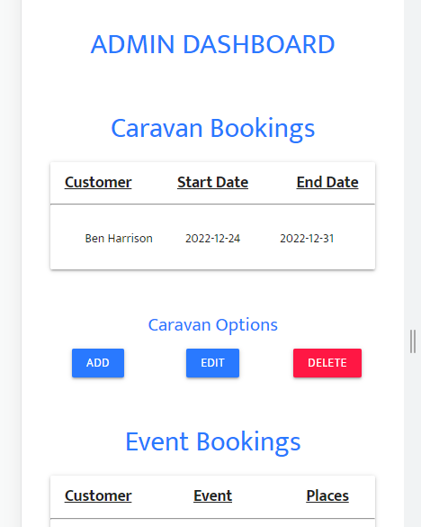

----
## Defensiveness
### Attempting book without being logged in
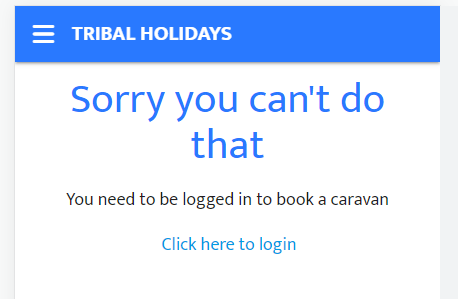

### Attempting to view the admin dashboard without being an admin user

### Attempting to view another users profile
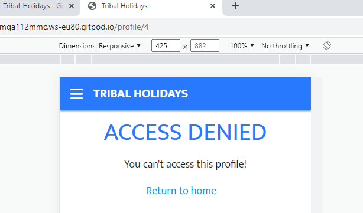

----
## User Interaction
### User Registration
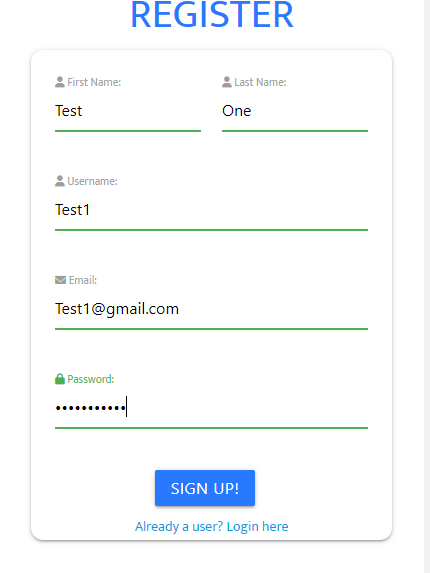
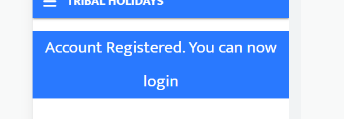
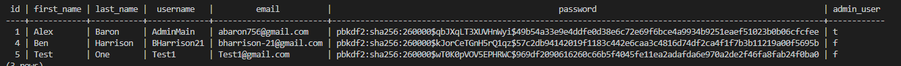

----
### User Logging In
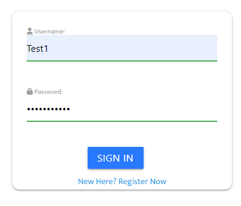
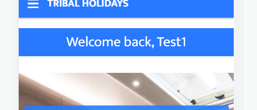

----
### Caravan Searching
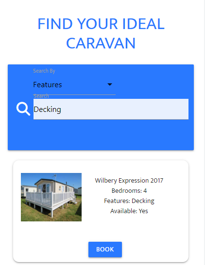
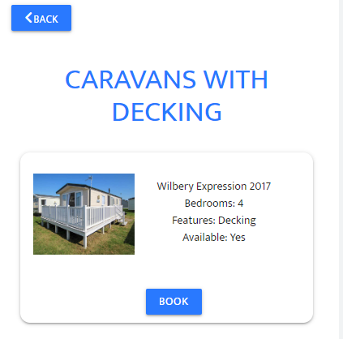

----
### Event Searching
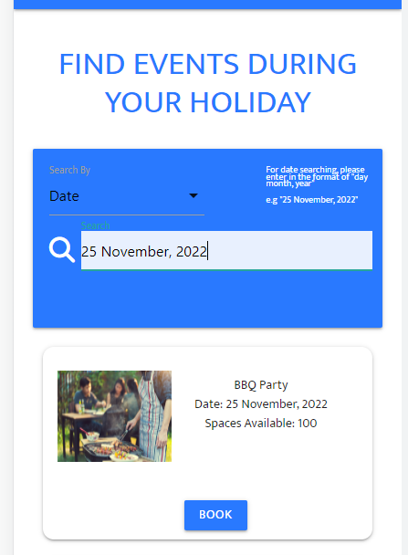
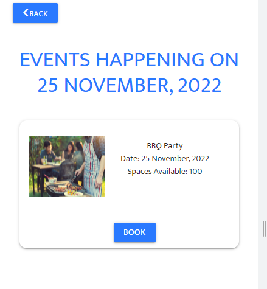

----
### Caravan Booking
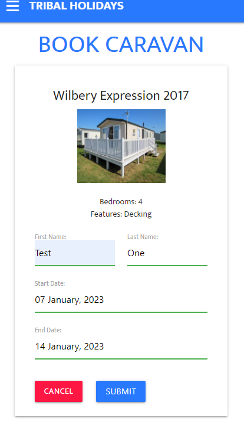
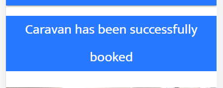
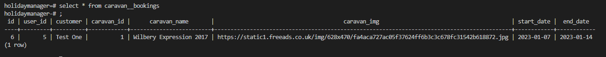

----
### Event Booking
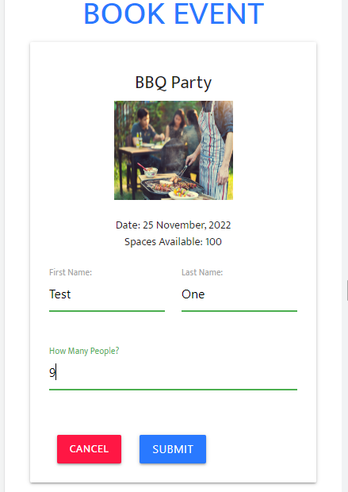
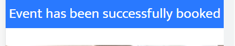
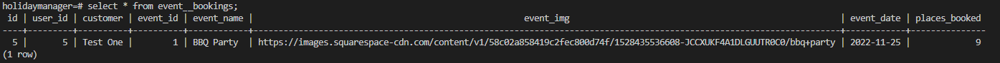

----
### Changing Account Details
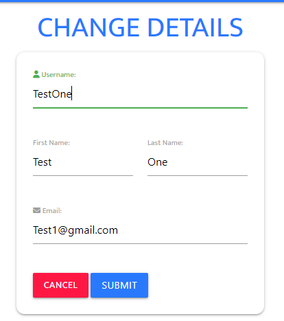
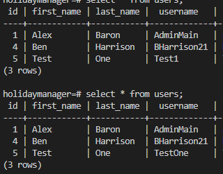

----
### Deleting Account
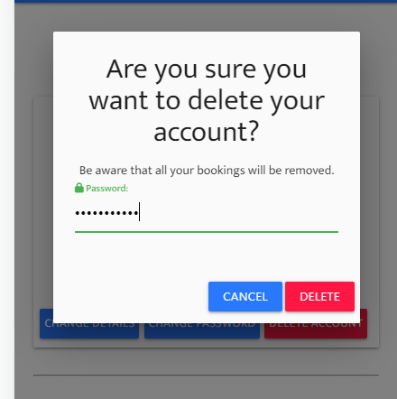
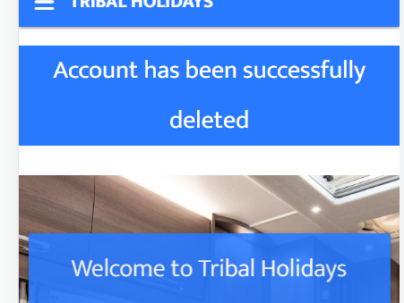
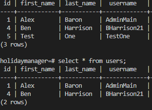

----
## Code Validation
### HTML
#### Home Page
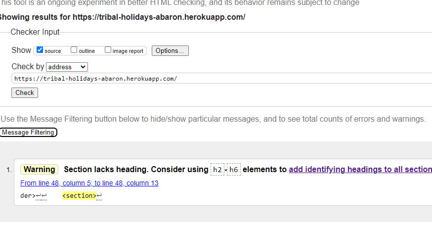

----
#### Register Page
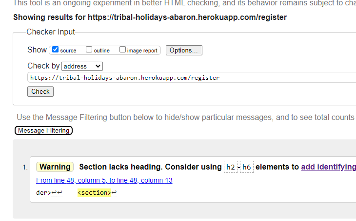

----
#### Login Page
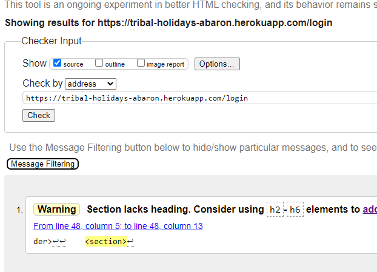

----
#### Caravans Page
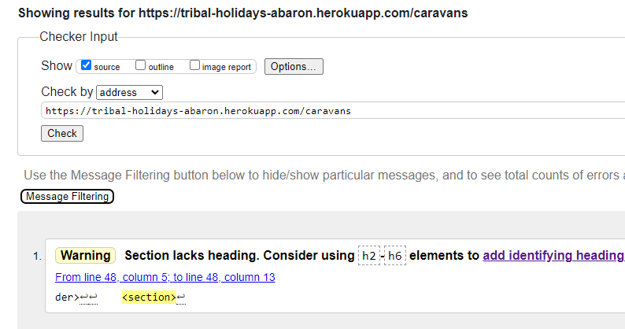

----
#### Events Page
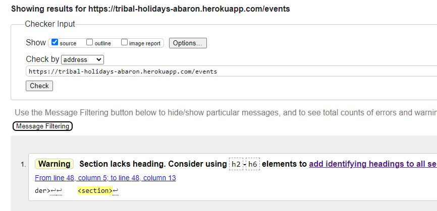

----
#### Caravans Searched Page
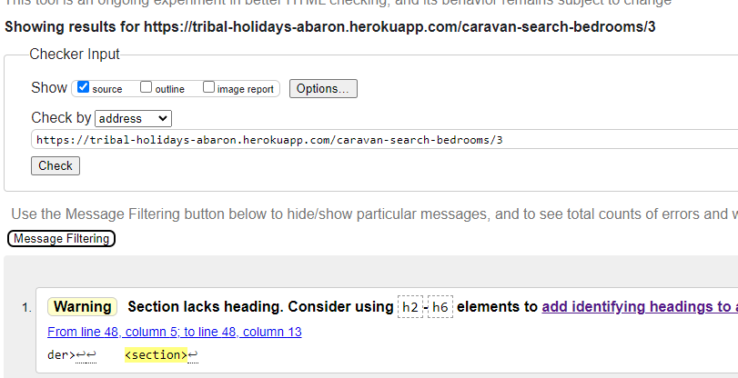

----
#### Events Searched Page
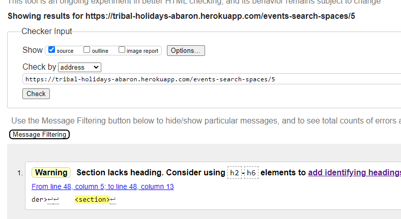

----
#### Caravan Booking Page
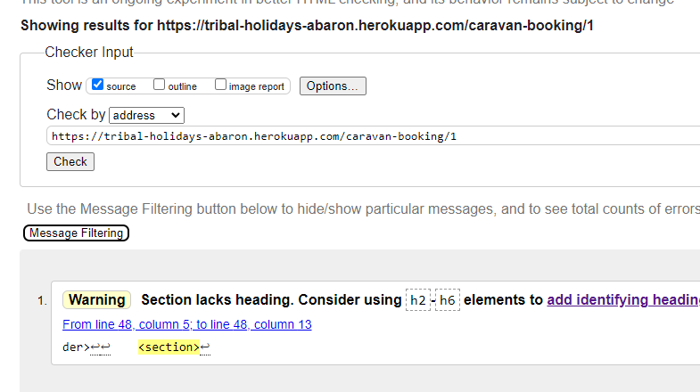

----
#### Event Booking Page
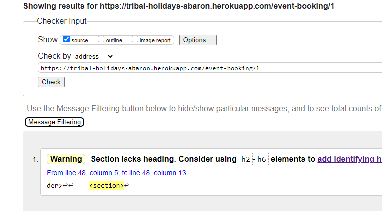

----
#### Admin Dashboard Page
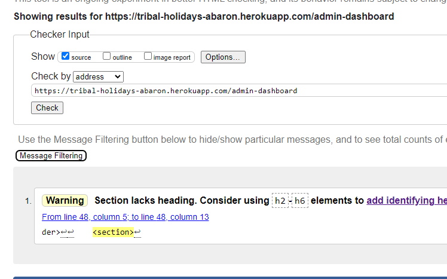

----
#### Profile Page
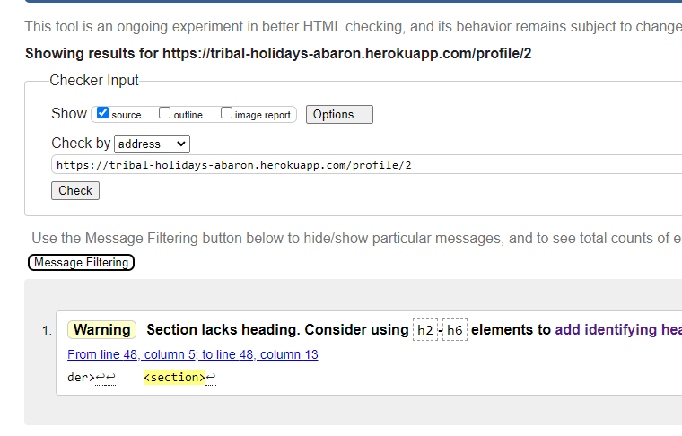

----
#### Change Details Page
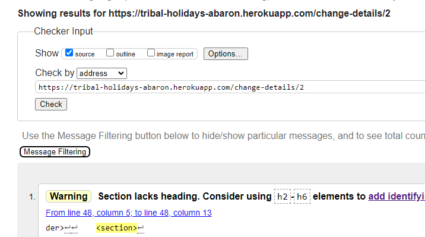

----
#### Change Password Page
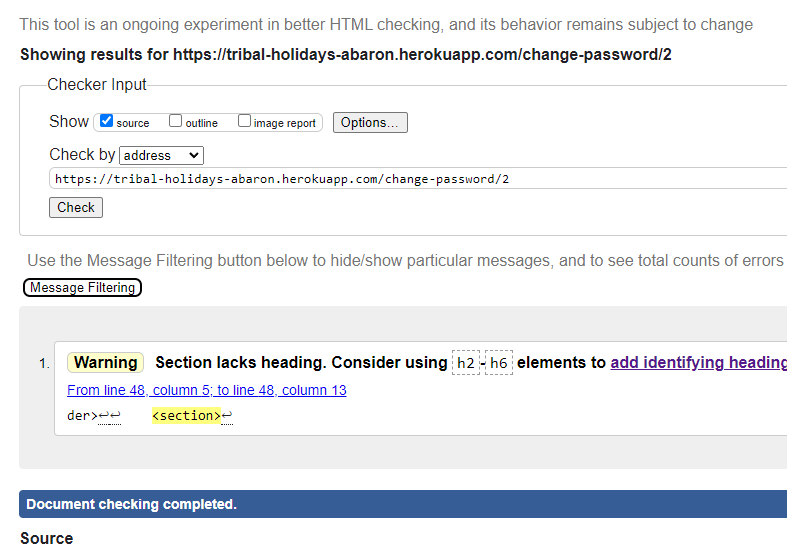

----
### CSS
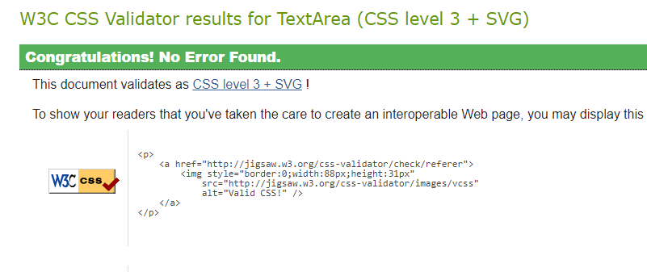

----
## Bugs
### Profile Page Bug
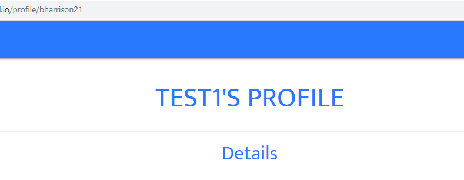

As shown above when the development test user tried to view their profile it would show the profile page for the 'Test One' user, the reason for this bug is that when retrieving a user's profile it does it based on the username given which has been stored as a session cookie when the user logged in.

To resolve this bug what was changed was that within the user session cookie it would store the users ID number instead of their username so this would allow for the user to be able to see their profile and only their profile, also with this change it allowed for the defensiveness to be put into place for the profile page.